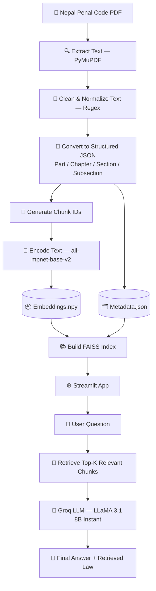

# 🇳🇵 Nepal Penal Code — Legal RAG Assistant

A Retrieval-Augmented Generation (RAG) system built on the **National Penal (Code) Act, 2017 (Nepal)**.  
Users can ask legal questions and receive grounded answers with **retrieved law context** — ensuring transparency and accuracy.

---

## 🚀 End-to-End Workflow



---

## 📁 Project Structure

```

rag/
│
├── pdf->text_nochunk/
│   ├── .DS_Store
│   ├── pdf->txt_nochunk.py
│   ├── pdf-to-text_extraction-without_chunk.json
│   ├── penal-english.pdf
│   ├── penal_code_input.txt
│   └── source_change.py
│
├── chunk_id-add/
│   ├── chunk_id-add.py
│   └── pdf->txt-with_chunk_id.json
│
├── embedding/
│   ├── embedding_code.py
│   ├── final_legal_embeddings.npy
│   ├── final_legal_laws_metadata.json
│   └── final_output.csv
│
├── .DS_Store
├── README.md
├── app.py
├── final_legal_embeddings.npy
├── final_legal_laws_metadata.json
└── requirements.txt

```

---

## 📌 Data Source

> **National Penal (Code) Act, 2017 — English Translation**  
> Source: https://bwcimplementation.org/sites/default/files/resource/NP_National%20Penal%20Code%20Act_EN.pdf

---

## 🛠️ Main Pipeline Scripts

### 1️⃣ Extract + Clean PDF → JSON

Uses **PyMuPDF + Regex** to parse:

✔ Part  
✔ Chapter  
✔ Section  
✔ Subsection  
✔ Text  
✔ Source link  

and output structured JSON.

> Preserves legal hierarchy for reliable retrieval.

---

### 2️⃣ Add Meaningful `chunk_id`

Format:

```
npc2017_p{part}_c{chapter}_s{section}_sub{subsection}
```

Example:

```
npc2017_p1_c1_s1_sub1
```

---

### 3️⃣ Generate Embeddings + Metadata

Model used:

```
sentence-transformers/all-mpnet-base-v2
```

Outputs:

| File | Description |
|------|------------|
| `final_legal_embeddings.npy` | Vector embeddings |
| `final_legal_laws_metadata.json` | Chunk metadata + text |

---

### 4️⃣ Streamlit RAG Application

Features:

✅ Query UI  
✅ Top-K FAISS retrieval  
✅ LLM answer generation using **Groq API**  
✅ Retrieved law displayed for transparency  

---

## 🔧 Installation

```bash
git clone your-repo
cd your-repo
python3 -m venv ragvenv
source ragvenv/bin/activate
pip install -r requirements.txt
```

---

## 🔑 Environment Variable

Create `.env` or export:

```bash
export GROQ_API_KEY="your_key_here"
```

---

## ▶️ Run App

```bash
streamlit run app.py
```

---

## 🧪 How It Works (Example)

### **Question**
> *"How is the liability determined for someone who assists a minor in committing an offense?"*

### **Retrieved Law Context**
```
[npc2017_p2_c3_s45_sub1] ...
[npc2017_p2_c3_s45_sub2] ...
[npc2017_p2_c3_s46_sub1] ...
```

### **AI Answer**
A grounded response referencing retrieved sections.

---

## 📌 Tech Stack

- **Python**
- **PyMuPDF**
- **Regex Parsing**
- **SentenceTransformers**
- **FAISS**
- **Streamlit**
- **Groq API (LLaMA-3.1-8B-Instant)**

---

## 🔒 Disclaimer

This project is **for educational & informational purposes only**  
It is **NOT a substitute for legal advice**.

---

## ⭐ Future Improvements

- Multi-law support (Civil Code, Evidence Act, etc.)
- Better chunking & cross-section linking
- Citation-aware LLM prompting
- UI enhancements
- Support Nepali language 🇳🇵

---

## 🙌 Author

**Yamraj Khadka** — Computer Engineering Student (Nepal)  
Passionate about **AI, ML & Real-world Impact Projects**

---

## 💙 Contribute / Feedback

Pull requests and suggestions are welcome!


```

---
