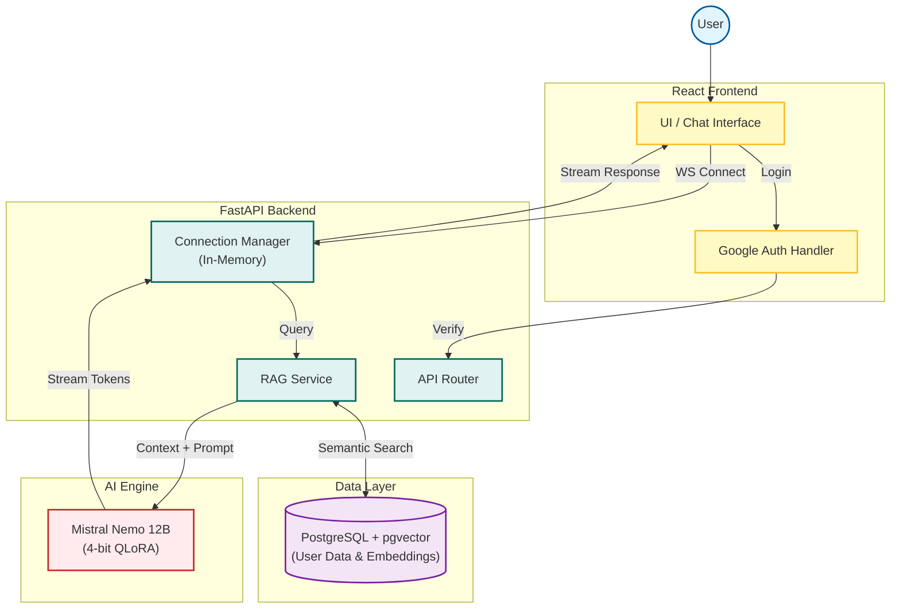

## 🏗️ System Architecture

The system follows a modern full-stack architecture optimized for async AI operations.

```mermaid
graph TD
    %% -- Styles --
    classDef client fill:#e1f5fe,stroke:#01579b,stroke-width:2px;
    classDef frontend fill:#fff9c4,stroke:#fbc02d,stroke-width:2px;
    classDef backend fill:#e0f2f1,stroke:#00695c,stroke-width:2px;
    classDef db fill:#f3e5f5,stroke:#7b1fa2,stroke-width:2px;
    classDef ai fill:#ffebee,stroke:#c62828,stroke-width:2px;

    %% -- Nodes --
    User((User)):::client
    subgraph Frontend ["React Frontend"]
        UI["UI / Chat Interface"]:::frontend
        Auth["Google Auth Handler"]:::frontend
    end
    
    subgraph Backend ["FastAPI Backend"]
        API["API Router"]:::backend
        ConnMgr["Connection Manager<br/>(In-Memory)"]:::backend
        RAG["RAG Service"]:::backend
    end
    
    subgraph Database ["Data Layer"]
        PG[("PostgreSQL + pgvector<br/>(User Data & Embeddings)")]:::db
    end
    
    subgraph AI ["AI Engine"]
        LLM["Mistral Nemo 12B<br/>(4-bit QLoRA)"]:::ai
    end

    %% -- Flows --
    User --> UI
    UI -->|Login| Auth
    Auth -->|Verify| API
    UI -->|WS Connect| ConnMgr
    ConnMgr -->|Query| RAG
    RAG <-->|Semantic Search| PG
    RAG -->|Context + Prompt| LLM
    LLM -->|Stream Tokens| ConnMgr
    ConnMgr -->|Stream Response| UI
```

---
